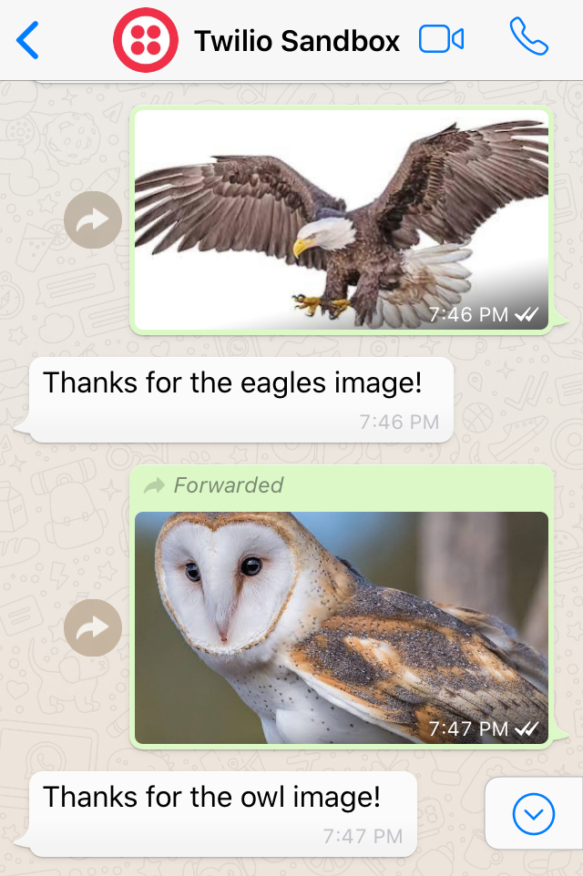
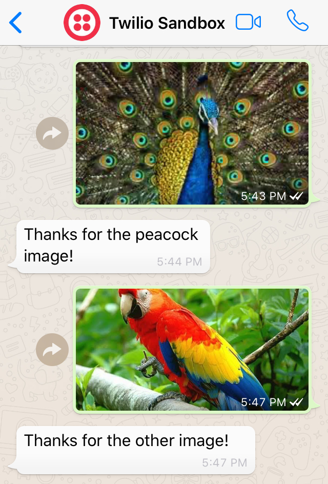
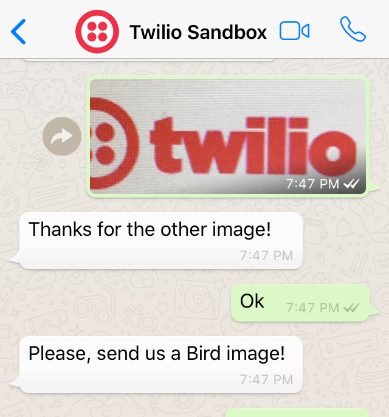

# Bird Images Classifier in WhatsApp using Twilio
## Bird class Identified:  'Egale' , 'Owal', 'Peacock', 'Other'

## Author	

[Mandeep Vakani](https://www.linkedin.com/in/mandeepvakani/)

The following were used (see [requirements.txt](requirements.txt)):    

- Python:  version 3.7.1
- Flask:  version 1.0.2
- Twilio: version 6.33.0
- PyTorch:  version  1.2.0
- Fastai:  version 1.0.57

## Description

A Deep Learning - CNN Model - resnet34 Architechure was trained on birds images collected on internet on Windows 10 Desktop with i5 processor and nvidia GTX-1070 GPU graphic card.
The trained model was exported to work CPU and is deployed on laptop for the production inferance.

Flask is used to expose Restful Serveice for model inference to predict any images, for POST request on /whatsapp route.

Twilio is used to receive chat message with images from WhatsApp chat. Twilio sandbox is configured for the /whatsapp route.

The App is Dockerized and deployed on Heroku: Cloud Application Platform. ( For detail steps see [Deployment Guide] (Deployment_Guide.md) )

## Demo

